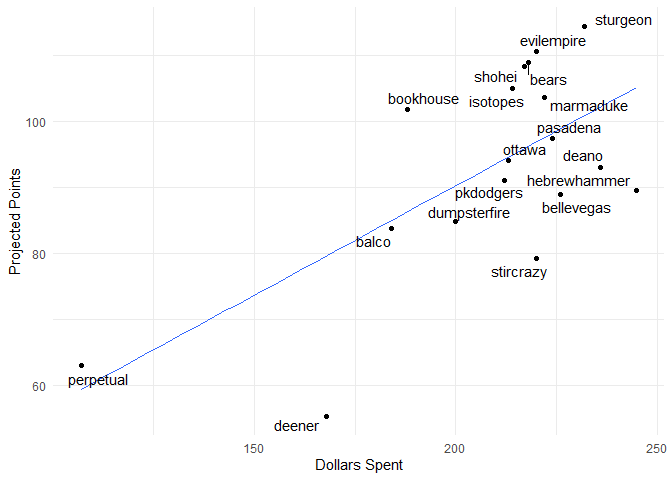
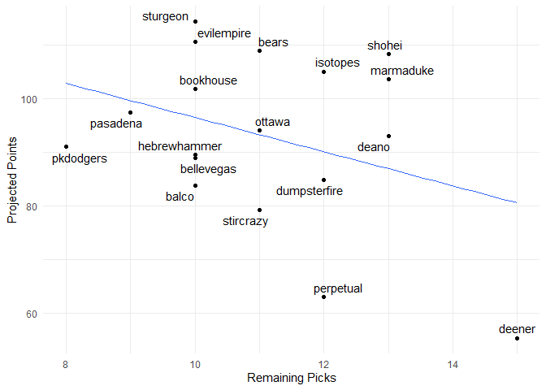

Fantasy 2022
================

#### Today's auction

| Name              | Team | position |  marginal\_total\_points|  dollar\_value|  auction\_value| status |
|:------------------|:-----|:---------|------------------------:|--------------:|---------------:|:-------|
| Nicky Lopez       | NA   | NA       |                       NA|             NA|              NA| NA     |
| Willson Contreras | NA   | NA       |                       NA|             NA|              NA| NA     |
| Cole Irvin        | NA   | NA       |                       NA|             NA|              NA| NA     |
| Justin Turner     | NA   | NA       |                       NA|             NA|              NA| NA     |
| Abraham Toro      | NA   | NA       |                       NA|             NA|              NA| NA     |
| David Bednar      | NA   | NA       |                       NA|             NA|              NA| NA     |
| Eric Hosmer       | NA   | NA       |                       NA|             NA|              NA| NA     |
| Eugenio Suarez    | NA   | NA       |                       NA|             NA|              NA| NA     |

#### Draft Status

| position    |  remaining|   max|  avg|
|:------------|----------:|-----:|----:|
| 1b          |          4|  13.6|  7.3|
| 1b, 3b      |          2|  13.5|  9.3|
| 1b, catcher |          1|   4.9|  4.9|
| 1b, dh      |          1|   4.5|  4.5|
| 1b, dh, of  |          2|  15.6|  9.3|
| 1b, of      |          2|   2.9|  2.8|
| 2b          |         10|  13.5|  5.5|
| 2b, 3b      |          1|   1.1|  1.1|
| 2b, of      |          2|   8.3|  6.5|
| 2b, ss      |          5|  14.9|  7.1|
| 3b          |          6|   8.8|  5.1|
| 3b, of      |          1|   5.5|  5.5|
| 3b, ss      |          1|   2.1|  2.1|
| catcher     |         20|  11.2|  5.5|
| catcher, dh |          1|   3.3|  3.3|
| dh          |          1|   2.6|  2.6|
| dh, of      |          3|   9.0|  5.9|
| of          |         38|  15.2|  7.5|
| ss          |          8|  11.3|  4.8|
| pitcher     |         73|  11.7|  4.7|

| name  |  value|
|:------|------:|
| 1B    |      3|
| 2B    |      5|
| 3B    |      4|
| CI    |      9|
| DH    |     17|
| MI    |     14|
| SS    |      4|
| C     |     25|
| OF    |     44|
| P     |     75|
| Total |    200|

#### Current Standings

| team         |  total\_points|  hit\_points|  pitch\_points|
|:-------------|--------------:|------------:|--------------:|
| sturgeon     |          114.4|         63.0|           51.4|
| evilempire   |          110.7|         66.2|           44.5|
| bears        |          109.0|         63.8|           45.2|
| shohei       |          108.3|         58.3|           50.0|
| isotopes     |          105.1|         57.2|           47.9|
| marmaduke    |          103.6|         57.6|           46.0|
| bookhouse    |          101.8|         52.0|           49.8|
| pasadena     |           97.4|         57.6|           39.8|
| ottawa       |           94.1|         61.7|           32.4|
| deano        |           93.1|         44.6|           48.5|
| pkdodgers    |           91.0|         49.8|           41.2|
| hebrewhammer |           89.5|         38.1|           51.4|
| bellevegas   |           89.0|         40.9|           48.1|
| dumpsterfire |           84.8|         39.0|           45.8|
| balco        |           83.8|         37.0|           46.8|
| stircrazy    |           79.2|         36.5|           42.7|
| perpetual    |           62.9|         31.6|           31.3|
| deener       |           55.3|         40.4|           14.9|

#### Top Remaining Pitchers

| Name             | Team |   IP|   ERA|  WHIP|    K|   SV|    W|   pts|    dlr|
|:-----------------|:-----|----:|-----:|-----:|----:|----:|----:|-----:|------:|
| Blake Treinen    | LAD  |   70|  3.42|  1.24|   80|   27|    4|  6.59|  11.72|
| Lucas Sims       | CIN  |   65|  3.70|  1.20|   89|   26|    3|  6.15|  10.92|
| Steven Matz      | STL  |  161|  3.91|  1.25|  154|    0|   10|  5.79|  10.27|
| Carlos Carrasco  | NYM  |  144|  3.76|  1.22|  153|    0|    9|  5.66|  10.04|
| Rowan Wick       | CHC  |   64|  4.05|  1.34|   69|   29|    3|  5.36|   9.49|
| Patrick Corbin   | WSN  |  174|  4.15|  1.33|  168|    0|   11|  5.35|   9.48|
| Alex Cobb        | SFG  |  151|  3.67|  1.29|  144|    0|   10|  5.31|   9.40|
| Andrew Kittredge | TBR  |   65|  3.29|  1.17|   70|   20|    4|  4.99|   8.82|
| Kyle Gibson      | PHI  |  189|  4.18|  1.38|  173|    0|   11|  4.93|   8.69|
| Kyle Finnegan    | WSN  |   66|  4.21|  1.39|   69|   28|    3|  4.81|   8.49|
| Andrew Heaney    | LAD  |  134|  4.16|  1.22|  149|    0|    9|  4.75|   8.38|
| Taijuan Walker   | NYM  |  166|  4.26|  1.31|  160|    0|   10|  4.74|   8.35|
| Yusei Kikuchi    | SEA  |  152|  4.03|  1.31|  147|    0|   10|  4.61|   8.12|
| Garrett Whitlock | BOS  |   68|  3.76|  1.26|   71|   20|    4|  4.34|   7.63|
| Pierce Johnson   | SDP  |   64|  3.67|  1.26|   78|   20|    3|  4.20|   7.37|

#### Top Remaining Hitters

<table style="width:100%;">
<colgroup>
<col width="19%" />
<col width="5%" />
<col width="9%" />
<col width="9%" />
<col width="9%" />
<col width="9%" />
<col width="10%" />
<col width="10%" />
<col width="9%" />
<col width="9%" />
</colgroup>
<thead>
<tr class="header">
<th align="left">Name</th>
<th align="left">Team</th>
<th align="right">PA</th>
<th align="right">R</th>
<th align="right">HR</th>
<th align="right">RBI</th>
<th align="right">SB</th>
<th align="right">AVG</th>
<th align="right">pts</th>
<th align="right">dlr</th>
</tr>
</thead>
<tbody>
<tr class="odd">
<td align="left">Trey Mancini</td>
<td align="left">BAL</td>
<td align="right">633.6667</td>
<td align="right">81.01778</td>
<td align="right">26.33881</td>
<td align="right">81.30309</td>
<td align="right">0.6610806</td>
<td align="right">0.2620000</td>
<td align="right">4.360874</td>
<td align="right">15.63146</td>
</tr>
<tr class="even">
<td align="left">Eddie Rosario</td>
<td align="left">NA</td>
<td align="right">520.3333</td>
<td align="right">63.97473</td>
<td align="right">22.31367</td>
<td align="right">74.58071</td>
<td align="right">8.6929942</td>
<td align="right">0.2610000</td>
<td align="right">4.236587</td>
<td align="right">15.20875</td>
</tr>
<tr class="odd">
<td align="left">Tommy Pham</td>
<td align="left">NA</td>
<td align="right">538.3333</td>
<td align="right">72.35732</td>
<td align="right">17.33135</td>
<td align="right">59.30543</td>
<td align="right">14.6685081</td>
<td align="right">0.2573333</td>
<td align="right">4.213367</td>
<td align="right">15.12978</td>
</tr>
<tr class="even">
<td align="left">Austin Hays</td>
<td align="left">BAL</td>
<td align="right">570.3333</td>
<td align="right">72.68981</td>
<td align="right">23.97987</td>
<td align="right">71.95742</td>
<td align="right">6.6650327</td>
<td align="right">0.2566667</td>
<td align="right">4.167756</td>
<td align="right">14.97466</td>
</tr>
<tr class="odd">
<td align="left">Jean Segura</td>
<td align="left">PHI</td>
<td align="right">604.6667</td>
<td align="right">78.67812</td>
<td align="right">15.70049</td>
<td align="right">64.14473</td>
<td align="right">9.0103513</td>
<td align="right">0.2810000</td>
<td align="right">4.373114</td>
<td align="right">14.87309</td>
</tr>
<tr class="even">
<td align="left">Marcell Ozuna</td>
<td align="left">ATL</td>
<td align="right">520.3333</td>
<td align="right">67.46822</td>
<td align="right">25.10730</td>
<td align="right">75.63454</td>
<td align="right">2.3109027</td>
<td align="right">0.2643333</td>
<td align="right">3.788563</td>
<td align="right">13.68501</td>
</tr>
<tr class="odd">
<td align="left">Bobby Dalbec</td>
<td align="left">BOS</td>
<td align="right">535.6667</td>
<td align="right">71.01932</td>
<td align="right">31.02194</td>
<td align="right">80.36558</td>
<td align="right">2.9918136</td>
<td align="right">0.2383333</td>
<td align="right">4.011119</td>
<td align="right">13.64193</td>
</tr>
<tr class="even">
<td align="left">Lourdes Gurriel Jr.</td>
<td align="left">TOR</td>
<td align="right">547.6667</td>
<td align="right">67.66735</td>
<td align="right">21.99442</td>
<td align="right">74.65859</td>
<td align="right">3.6640295</td>
<td align="right">0.2683333</td>
<td align="right">3.773700</td>
<td align="right">13.63446</td>
</tr>
<tr class="odd">
<td align="left">Kolten Wong</td>
<td align="left">MIL</td>
<td align="right">578.0000</td>
<td align="right">76.28909</td>
<td align="right">13.00518</td>
<td align="right">55.50476</td>
<td align="right">14.6639791</td>
<td align="right">0.2646667</td>
<td align="right">3.980267</td>
<td align="right">13.53700</td>
</tr>
<tr class="even">
<td align="left">A.J. Pollock</td>
<td align="left">LAD</td>
<td align="right">459.6667</td>
<td align="right">61.88200</td>
<td align="right">21.71009</td>
<td align="right">68.41361</td>
<td align="right">7.0178063</td>
<td align="right">0.2666667</td>
<td align="right">3.732183</td>
<td align="right">13.49326</td>
</tr>
<tr class="odd">
<td align="left">Miguel Sano</td>
<td align="left">MIN</td>
<td align="right">577.6667</td>
<td align="right">77.09336</td>
<td align="right">33.03553</td>
<td align="right">83.73172</td>
<td align="right">1.9726884</td>
<td align="right">0.2236667</td>
<td align="right">3.954958</td>
<td align="right">13.45093</td>
</tr>
<tr class="even">
<td align="left">Ramon Laureano</td>
<td align="left">OAK</td>
<td align="right">524.0000</td>
<td align="right">66.70802</td>
<td align="right">20.34720</td>
<td align="right">62.30273</td>
<td align="right">11.9912762</td>
<td align="right">0.2480000</td>
<td align="right">3.691569</td>
<td align="right">13.35513</td>
</tr>
<tr class="odd">
<td align="left">Anthony Santander</td>
<td align="left">BAL</td>
<td align="right">549.3333</td>
<td align="right">67.66925</td>
<td align="right">26.68128</td>
<td align="right">75.65996</td>
<td align="right">2.3263462</td>
<td align="right">0.2510000</td>
<td align="right">3.519007</td>
<td align="right">12.76825</td>
</tr>
<tr class="even">
<td align="left">Max Kepler</td>
<td align="left">MIN</td>
<td align="right">552.3333</td>
<td align="right">73.66788</td>
<td align="right">24.00085</td>
<td align="right">68.66350</td>
<td align="right">7.6655369</td>
<td align="right">0.2336667</td>
<td align="right">3.448286</td>
<td align="right">12.52772</td>
</tr>
<tr class="odd">
<td align="left">Harrison Bader</td>
<td align="left">STL</td>
<td align="right">524.6667</td>
<td align="right">63.77552</td>
<td align="right">18.33349</td>
<td align="right">60.96828</td>
<td align="right">12.0080049</td>
<td align="right">0.2456667</td>
<td align="right">3.221104</td>
<td align="right">11.75507</td>
</tr>
</tbody>
</table>

#### Remaining Picks vs. projected points

#### Best Draft Picks

| team | player |  salary|  dollar\_value|  equity|
|:-----|:-------|-------:|--------------:|-------:|

#### Unmatched Draft Picks

| player            | team         | error       |
|:------------------|:-------------|:------------|
| Corbin Carroll    | pasadena     | not matched |
| Robert Hassell    | pasadena     | not matched |
| Brett Baty        | evilempire   | not matched |
| Nick Gonzales     | evilempire   | not matched |
| CJ Abrams         | isotopes     | not matched |
| Josh Jung         | isotopes     | not matched |
| Triston Casas     | deano        | not matched |
| Zac Veen          | deano        | not matched |
| Anthony Volpe     | bears        | not matched |
| Marcelo Mayer     | bears        | not matched |
| Francisco Alvarez | bookhouse    | not matched |
| Royce Lewis       | perpetual    | not matched |
| Nolan Gorman      | bellevegas   | not matched |
| Jordan Walker     | bellevegas   | not matched |
| Hunter Greene     | balco        | not matched |
| Nick Pratto       | balco        | not matched |
| Jasson Dominguez  | balco        | not matched |
| Marco Luciano     | ottawa       | not matched |
| Gabriel Moreno    | ottawa       | not matched |
| Nolan Jones       | ottawa       | not matched |
| Henry Davis       | sturgeon     | not matched |
| Wilman Diaz       | stircrazy    | not matched |
| Drew Waters       | perpetual    | not matched |
| Jack Leiter       | pkdodgers    | not matched |
| Elijah Green      | marmaduke    | not matched |
| Jordan Lawlar     | marmaduke    | not matched |
| Garrett Mitchell  | shohei       | not matched |
| Cade Cavalli      | shohei       | not matched |
| Noelvi Marte      | deener       | not matched |
| Heston Kjerstad   | deener       | not matched |
| Kevin Kopps       | deener       | not matched |
| Spencer Torkelson | hebrewhammer | not matched |
| Sam Huff          | hebrewhammer | not matched |
| Diego Cartaya     | pkdodgers    | not matched |
